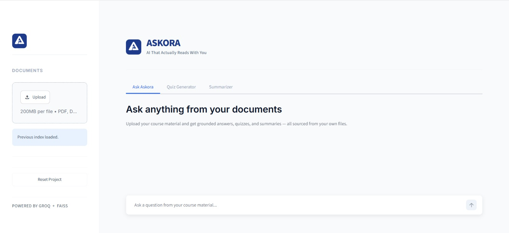
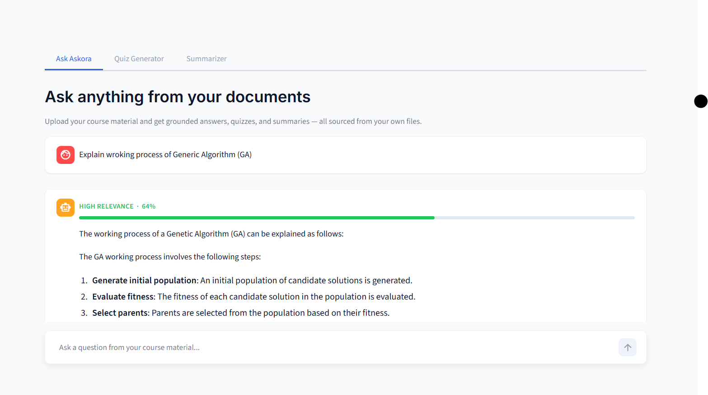
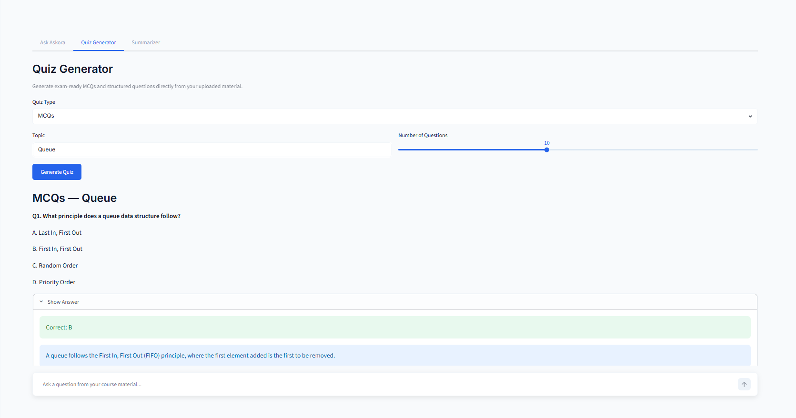
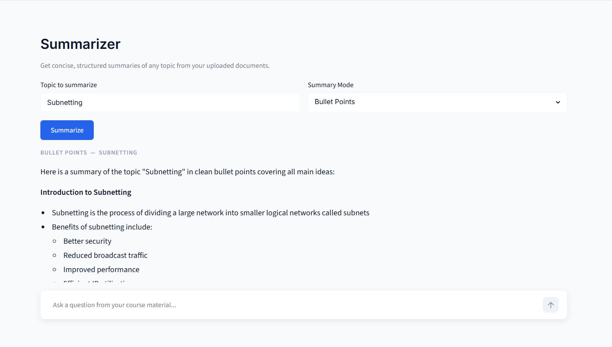

# Askora — AI Academic Assistant

> An AI-powered academic assistant that helps students interact with study material through question answering, document understanding, summarization, and quiz generation.

## Overview

**Askora** is an AI academic assistant built with **Python and Streamlit**. It uses a **Retrieval-Augmented Generation (RAG)** workflow to work with academic documents and provide context-aware answers.

The goal of Askora is to make study material easier to search, understand, summarize, and revise.

## Key Features

* **Ask Questions** — Ask questions about uploaded academic material.
* **RAG-based Retrieval** — Retrieves relevant document content before generating answers.
* **PDF Processing** — Processes academic PDF documents for retrieval.
* **Summarization** — Generates concise summaries of study material.
* **Quiz Generator** — Creates quizzes from academic content for revision.
* **FAISS-based Search** — Uses vector similarity search for relevant content retrieval.
* **Streamlit Interface** — Provides a simple interactive web interface.
* **Secure API Configuration** — API credentials are kept outside the repository using environment variables.

## Tech Stack

| Technology     | Purpose                          |
| -------------- | -------------------------------- |
| Python         | Core application logic           |
| Streamlit      | Web application interface        |
| RAG            | Context-aware question answering |
| FAISS          | Vector similarity search         |
| Groq API       | AI/LLM integration               |
| PDF Processing | Academic document extraction     |
| CSS            | Interface styling                |

## Project Structure

```text
Askora/
│
├── app.py
├── config.py
├── requirements.txt
├── .gitignore
├── README.md
│
├── .streamlit/
│   └── config.toml
│
├── screenshots/
│   ├── interface.png
│   ├── ask.png
│   ├── quiz.png
│   └── summarizer.png
│
└── src/
    ├── __init__.py
    ├── embeddings.py
    ├── pdf_processor.py
    ├── quiz_generator.py
    ├── retriever.py
    ├── summarizer.py
    └── style.css
```

## Application Screenshots

### Main Interface



### Ask Questions



### Quiz Generator



### Summarizer



## Installation

### 1. Clone the repository

```bash
git clone https://github.com/MehXarii/Askora.git
cd Askora
```

### 2. Create a virtual environment

Windows:

```bash
python -m venv venv
venv\Scripts\activate
```

### 3. Install dependencies

```bash
pip install -r requirements.txt
```

### 4. Configure environment variables

Create a `.env` file in the project root:

```env
GROQ_API_KEY=your_api_key_here
```

Do **not** commit your real API key to GitHub.

### 5. Run the application

```bash
streamlit run app.py
```

The application will open in your browser.

## How It Works

Askora follows a RAG-based workflow:

```text
Academic Documents
       ↓
   PDF Processing
       ↓
 Text / Chunk Extraction
       ↓
    Embeddings
       ↓
      FAISS
       ↓
Relevant Context Retrieval
       ↓
      LLM / AI
       ↓
Answer / Summary / Quiz
```

## Use Cases

Askora can be used for:

* Academic question answering
* Exam preparation
* Revision and summarization
* Understanding lecture notes
* Generating practice quizzes
* Searching large collections of study material

## Security

Sensitive credentials are stored in environment variables and excluded from version control.

Never upload API keys, passwords, tokens, or other secrets to the repository.

## Future Improvements

* Conversation history
* Support for more document formats
* Improved citation and source referencing
* User authentication
* Cloud deployment
* Advanced study analytics
* Personalized learning recommendations

## Author

**Mehak Ansari**

BSCS Student | AI & Computer Science

GitHub: [@MehXarii](https://github.com/MehXarii)

---

## License

This project is available for educational and portfolio purposes.